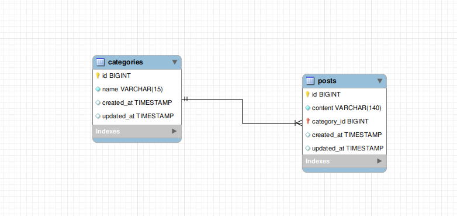

# Adcash test task

## Setup

Run `composer install`. Next run `./vendor/bin/sail up`.

To migrate DB tables use `./vendor/bin/sail artisan migrate`.

Front-end assets can be compiled using `./vendor/bin/sail npm run prod`.

## API routes

**Getting‌ ‌the‌ ‌list‌ ‌of‌ ‌all‌ ‌categories**

GET api/categories

**Getting‌ ‌the‌ ‌list‌ ‌of‌ ‌posts‌ ‌of‌ ‌a‌ ‌concrete‌ ‌category**

GET api/categories/{id}/posts

**Create‌ ‌of‌ ‌category**

POST ‌api/categories

{
    "name": "Hello1435"
}

**Update‌ ‌of‌ ‌category**

PUT api/categories/{id}

{
    "name": "Hello1435"
}

**Create ‌post**

POST api/posts

{
    "category_id": 2,
    "content": "post content"
}

**Update ‌post**

PUT api/posts/{id}

{
    "category_id": 1,
    "content": "Post new content"
}

**Delete ‌post**

DELETE api/posts/{id}

# Diagram

